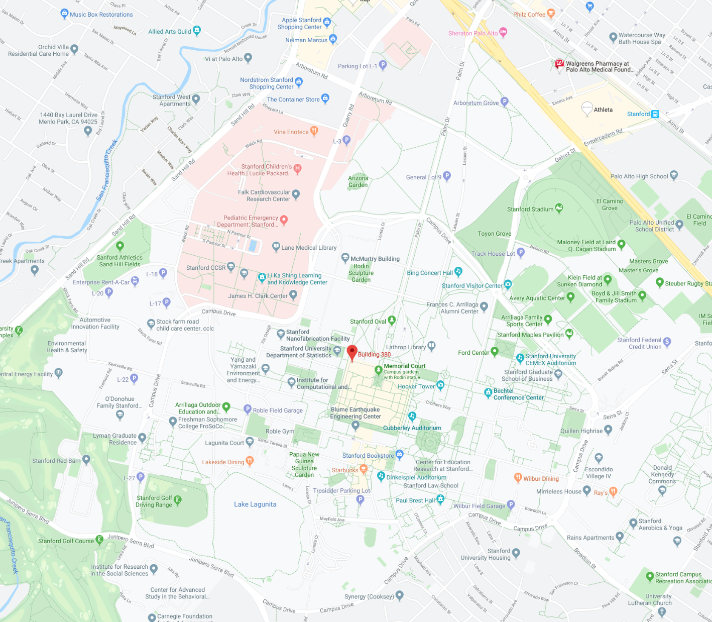

The WSSCI Spring Technical Meeting will be held on March 21-22, 2022 in Stanford, CA.

## Conference Location

The conference will be held at Stanford Campus:
[450 Jane Stanford Way, Building 380 ("Math Corner")<i class="fa fa-external-link fa-fw" aria-hidden="true"></i>](https://www.google.com/maps/place/Building+380/@37.4287657,-122.1713269,15z/data=!4m5!3m4!1s0x0:0xa26502e9f757c00f!8m2!3d37.4287657!4d-122.1713269). The conference venue is near the Stanford Oval, and about a mile away from downtown Palo Alto on Palm Drive/University Ave.

## Accommodations

Discounted accommodations for meeting participants have been reserved at four hotels near the Stanford Campus:

#### Stanford Guest House
[<i class="fa fa-external-link fa-fw" aria-hidden="true"></i>**Stanford Guest House, 2575 Sand Hill Rd, Menlo Park, CA 94025**](https://rde.stanford.edu/hospitality/stanford-guest-house)\\
Phone: 650-926-2800\\
Rate: $174/night plus tax\\
Rooms at discounted rates available until: 2/5/2020\\
Group code: WSSCI20\\
Note: Stanford Guest House is on the SLAC-facility, about two miles north of campus. A shuttle bus runs every 30 mins that brings you from the Guest House to Stanford Campus (travel time is about 20 mins)

#### Cardinal Hotel
[<i class="fa fa-external-link fa-fw" aria-hidden="true"></i>**Cardinal Hotel, 235 Hamilton Ave, Palo Alto, CA 94301**](https://cardinalhotel.com)\\
Phone: 650-323-5101\\
Rate: $159-$319/night plus tax\\
Book rooms at discounted rate via [WSSCI-reservation<i class="fa fa-external-link fa-fw" aria-hidden="true"></i>](https://res.windsurfercrs.com/ibe/details.aspx?propertyid=14212&nights=2&checkin=03/22/2020&group=Wssci2020)\\
Rooms at discounted rates available until: 2/22/2020\\
Note: Cardinal hotel is in downtown Palo Alto, about a mile from the conference venue via Palm Drive/University Ave. There are sidewalks and it is walkable (weather permitting). Other ways of transportation are via the
<a href="https://transportation.stanford.edu/marguerite">Stanford Marguerite Shuttle</a> (from Palo Alto train station), by ride-hailing, or by car.

#### Parmani Hotel
[<i class="fa fa-external-link fa-fw" aria-hidden="true"></i>**Hotel Parmani, 3200 El Camino Real, Palo Alto, CA 94306**](http://hotelparmani.com)\\
Phone: 650-493-9085\\
Rate: $185 - $205/night plus tax\\
Rooms at discounted rates available until: 1/22/2020\\
Group code: WSSCI\\
Note: Parmani Hotel is about 2.5 miles from campus. Public transportation is limited, and we recommend ride-hailing or car.

#### Faculty Club
[<i class="fa fa-external-link fa-fw" aria-hidden="true"></i>**Faculty Club, 439 Lagunita Drive, Stanford, CA 94305**](https://facultyclub.stanford.edu)\\
Phone: 650-723-9313\\
Rate: $297-$378/night plus tax\\
Note: Rooms are limited; please contact administrator <a href="mailto:susand2@stanford.edu?subject=WSSCI-meeting: Room Reservation at Faculty Club">Susan Dorman</a> for room reservation

## Travel

Stanford University is conveniently located near three regional airports: San Francisco Airport (SFO), San Jose Airport (SJC), and Oakland Airport (OAK).
Your transportation options to and from the main campus include driving, ride-hailing service, airport shuttles, and taxis.

### San Francisco International Airport

#### By car to Stanford:

Exit airport to US 101 South. Take the Embarcadero Road exit west toward Stanford. At El Camino Real, Embarcadero becomes Galvez Street as it enters the campus. For <a href="https://transportation.stanford.edu/parking/purchase-a-parking-permit/visitors">visitor parking information</a>, please refer to the <a href="https://stanford.box.com/v/Parking-and-Circulation-Map">Parking and Circulation Map</a>. Please check parking signs carefully and note that parking is enforced Monday - Friday, 8 a.m. – 4 p.m.

#### By public transportation to Stanford:
Take AirTrain to the International terminal, and board <a href="http://www.bart.gov/">BART</a> to San Bruno. At San Bruno, transfer to a Millbrae bound BART train. At Millbrae, exit the BART system, and board a southbound <a href="http://www.caltrain.com/timetable.html">Caltrain</a> to the Palo Alto Transit Center. Take the free <a href="https://transportation.stanford.edu/marguerite">Stanford Marguerite Shuttle</a> to the Oval.

### San Jose International Airport

#### By car to Stanford:
Exit airport and take Highway 87 to US 101 North. Take the Embarcadero Road exit West toward Stanford. At El Camino Real, Embarcadero becomes Galvez Street as it enters the campus. For <a href="https://transportation.stanford.edu/parking/purchase-a-parking-permit/visitors">visitor parking information</a>, please refer to the <a href="https://stanford.box.com/v/Parking-and-Circulation-Map">Parking and Circulation Map</a>. Please check parking signs carefully and note that parking is enforced Monday - Friday, 8 AM - 4 PM.

#### By public transportation to Stanford:
Exit terminal, and cross to bus pick-up. Take the free <a href="https://www.vta.org/go/routes/60?version=upcoming">VTA Bus 60</a> (Airport Flyer) to Santa Clara <a href="http://www.caltrain.com/timetable.html">Caltrain</a> Station. The bus is free when boarding at the airport.  Take Caltrain north to the Palo Alto Transit Center, and then take the free <a href="https://transportation.stanford.edu/marguerite">Stanford Marguerite Shuttle</a> to your campus destination (weekdays with limited weekend/holiday service).

### Oakland International Airport

#### By car to Stanford:
Exit airport to I-880 South, and take exit to CA-84 W (Dumbarton Bridge). Turn left at University Ave., and continue straight as it turns into Palm Drive after downtown Palo Alto. For <a href="https://transportation.stanford.edu/parking/purchase-a-parking-permit/visitors">visitor parking information</a>, please refer to the <a href="https://stanford.box.com/v/Parking-and-Circulation-Map">Parking and Circulation Map</a>. Please check parking signs carefully and note that parking is enforced Monday - Friday, 8 AM - 4 PM.

#### By public transportation to Stanford (not recommended):
Take <a href="http://www.bart.gov/guide/airport/outbound_oak.aspx">AirBART</a> to the Coliseum/Oakland Airport <a href="http://www.bart.gov/">BART</a> station. Take the BART Fremont line to Union City. At Union City, transfer to the <a href="https://dumbartonexpress.com/line-db-schedule/">Dumbarton Express</a> bus, which will take you to the Palo Alto Transit Center. Take the free <a href="https://transportation.stanford.edu/marguerite">Stanford Marguerite Shuttle</a> to your campus destination (weekdays with limited weekend/holiday service).

#### Location of venue

